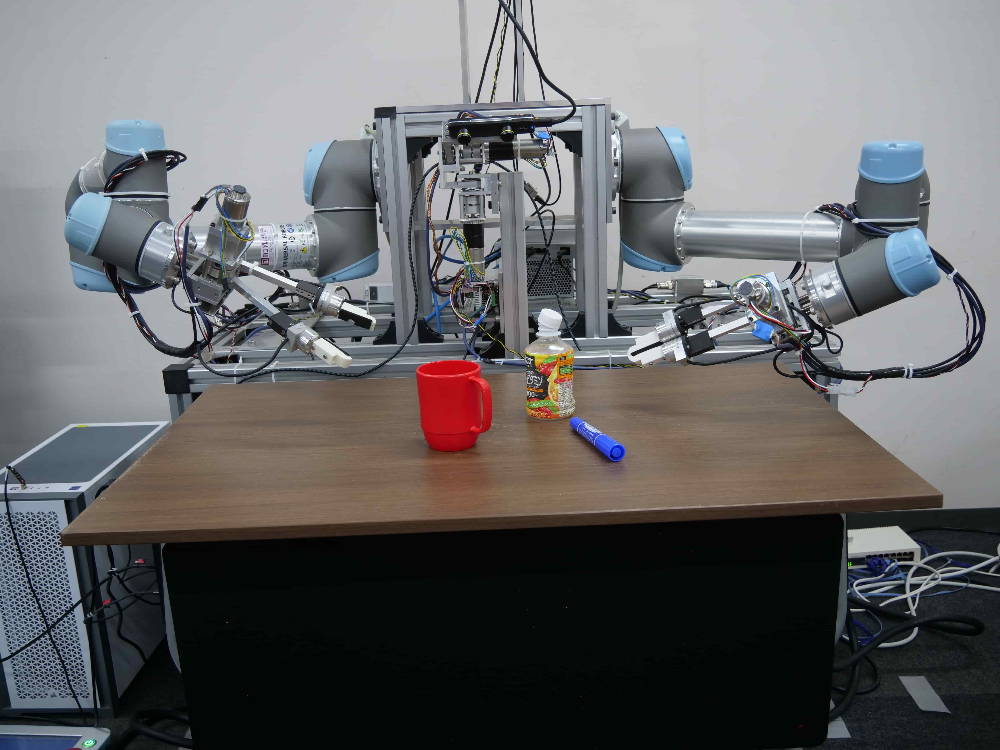
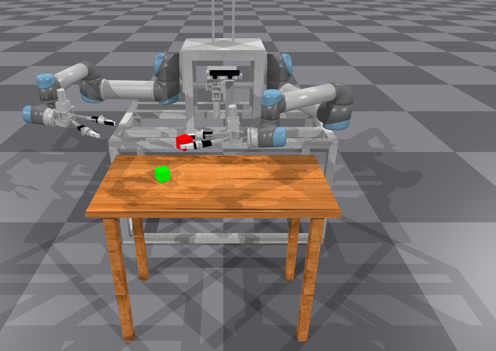

# tong_system

[Intelligent Systems and Informatics Laboratory](https://www.isi.imi.i.u-tokyo.ac.jp/?lang=ja), The University of Tokyo

**Information:** [Ryo Takizawa]()

 

---

## Overview

This package provides an API for ISI's robot manipulator system, "Tong system".  
It can be used as an interface for both real and simulated robots.

- **Simulator is available!:** [tong_simulator](https://github.com/crumbyRobotics/tong_simulator)

---

## Installation

### Requirements

- Python >= 3.9

### Install Dependencies

```bash
pip install -r requirements.txt 
```

### Install tong_system

```bash
pip install -e .
```

### Build Ikfastpy

Install required libraries:

```bash
sudo apt-get install liblapack-dev liblapack3 libopenblas-base libopenblas-dev
```

Build ikfastpy:

```bash
git submodule update --init --recursive
cd tongsystem/ikfastpy
python setup.py build_ext --inplace
```

---

## Running with Simulator
<div><video controls loop src="https://github.com/user-attachments/assets/43824e43-4a4b-493b-817c-469bd70ed6d3" muted="true" width=200></video></div>

1. **Clone and set up the simulator:**
    ```bash
    git clone https://github.com/crumbyRobotics/tong_simulator
    cd tong_simulator
    # Follow setup instructions in the simulator's README
    ```

2. **Launch the simulator (Terminal 1):**
    ```bash
    cd tong_simulator
    python main.py
    ```

3. **Run the example program (Terminal 2):**
    ```bash
    cd tong_system/tests
    python test_sim.py
    ```
